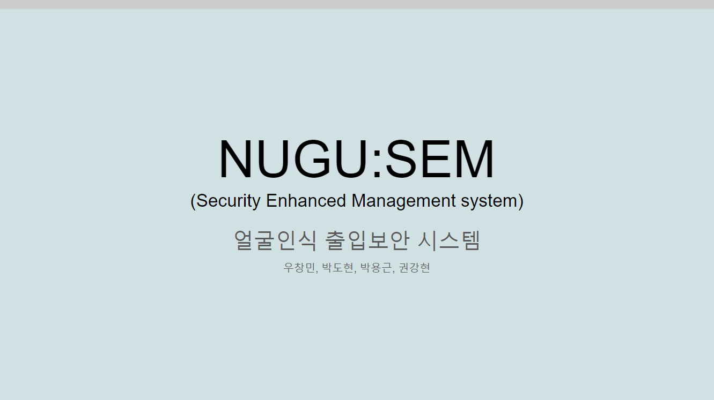
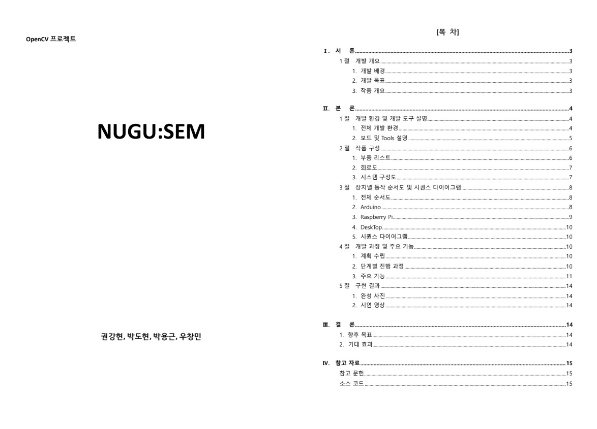

NUGU:SEM - "누구셈?" 얼굴인식 출입보안 서비스
============
## 프로젝트 설명
프로젝트 주제: OpenCV 영상처리 라이브러리를 활용한 프로그램 만들기 
 
프로젝트 수행자: 인텔 엣지AI SW개발자 아카데미 3기 / 팀 EOF (권강현, 박도현, 박용근, 우창민) 
 
프로젝트 수행기간: 23/11/18 ~ 23/12/03 

 
 

## 프로젝트 시연 영상
(아래 이미지를 클릭하시면 유튜브로 이동합니다.) 
 
 
 

## 프로젝트 발표 자료
(아래 이미지를 클릭하시면 구글 슬라이드로 이동합니다.) 
 
 
 

## 프로젝트 개발 명세서
(아래 이미지를 클릭하시면 구글 드라이브로 이동합니다.)
 
 
 

<!-- 

## 프로젝트 발표 영상
(아래 이미지를 클릭하시면 유튜브로 이동합니다.) 
 
 

 -->
